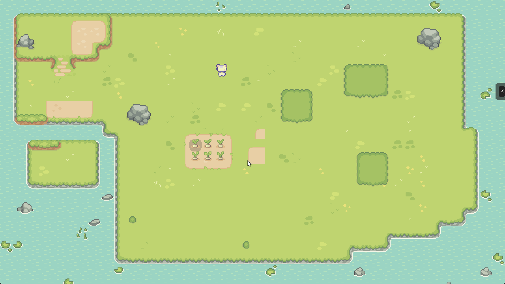
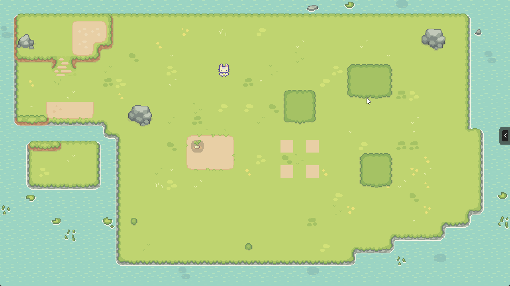
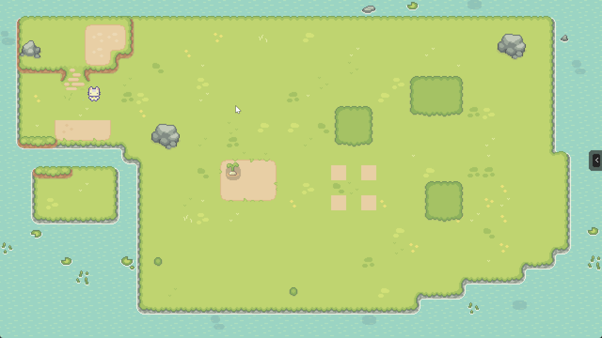
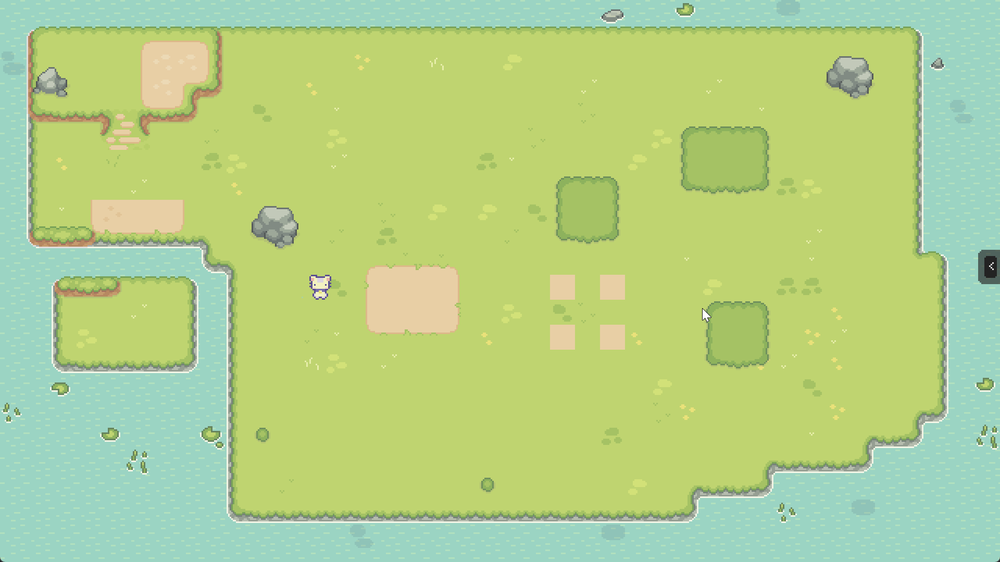
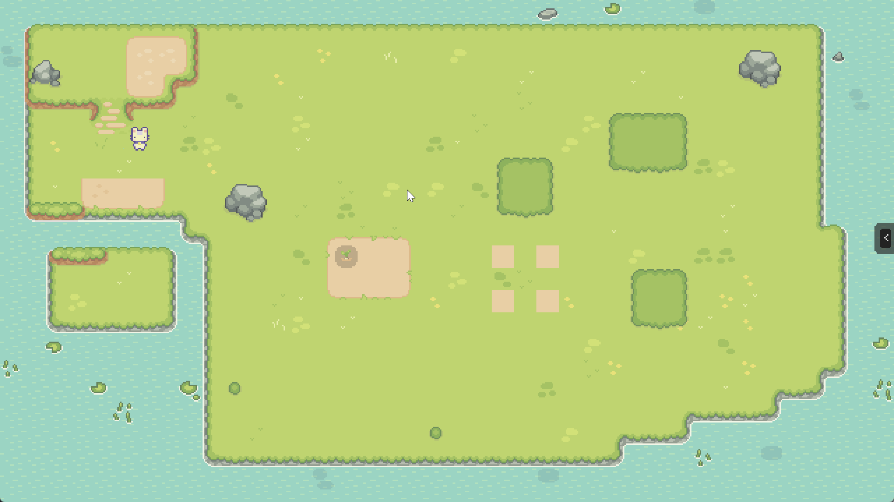

# August 2024 (version 0.1.0)

August was the first month of working on this project. The focus has been to jump straight into implementing the basics of the farming system.

## Major Features this Release
- imported a good chunk of the assets
- created basic first region tilemap
- added first cat worker as a player controlled character
- ability to move cat in cardinal directions
- hardcoded first tilled soil patch
- [an "action menu" that contains the different crops you can plant](#an-action-menu-that-contains-the-different-crops-you-can-plant)
- [ability to plant wheat, beet, lettuce](#ability-to-plant-wheat-beet-lettuce)
- [ability to place water in front of the cat by pressing `1`](#ability-to-place-water-in-front-of-the-cat-by-pressing-1)
- ability to pan the viewport with right mouse button
- [plants require water to continue growing](#plants-require-water-to-continue-growing)
- beginning of coin currency system. Crops cost coins, and provide revenue when deposited in storage
- [funsy mouse click particles](#funsy-mouse-click-particles)

## an "action menu" that contains the different crops you can plant

## ability to plant wheat, beet, lettuce

## ability to place water in front of the cat by pressing `1`

## plants require water to continue growing

## funsy mouse click particles

## Release Commit

Commit hash: `e45d844c6d3954c5d99292748cdcca985afc2a4f`