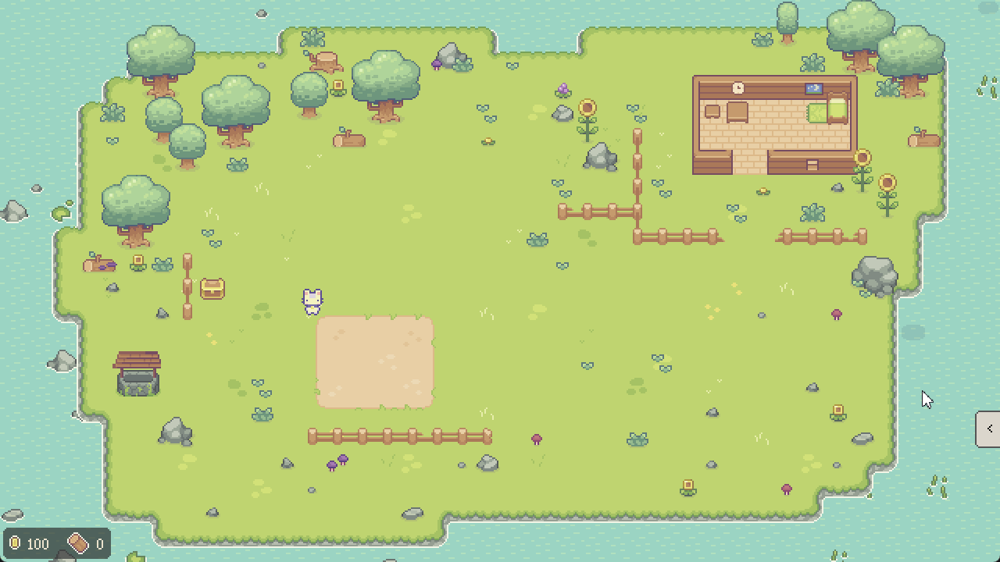
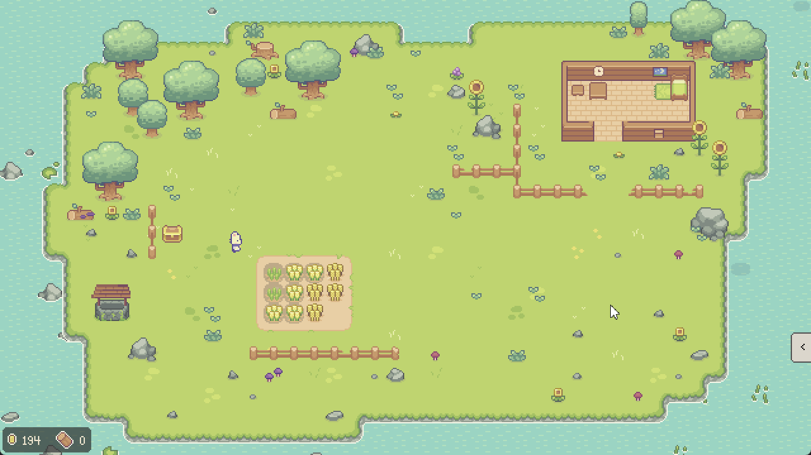

# September 2024 (version 0.2.0)

September continued to implement core gameplay functionality and shifted from manual player control to an automated job system.

## Major Features this Release
- [Added the ability to till soil](#added-the-ability-to-till-soil)
- Added autotiling to the tilled soil tilemap
- [Reworked the Action Menu UI](#reworked-the-action-menu-ui)
  - Added separate tabs for PLANT, BUILD, ABILITY, PRIORITY
  - BUILD, ABILITY, and PRIORITY buttons are not implemented yet with the exception of the Axe Ability
- Added "production" and "debug" settings
  - Adjusted production settings to provide a playable experience somewhat representative of the intended release behavior
- [Automated some game actions by implementing a job queue pubsub system](#automated-some-game-actions-by-implementing-a-job-queue-pubsub-system)
  - Events in the game such as a crop becoming ready to harvest will publish a message to the job queue
  - Cat workers in the region listen to that job queue and pick up the jobs and execute them
  - Implemented priority based on job type. Cat worker will grab job in order of priority job type, then by when the job was created
- Make the axe an unlockable in the BUILD menu. This introduces an "unlocked player skills/abilities" concept to the game.
- [Added "Wood Tree" -- can be chopped down to get wood resource](#added-wood-tree----can-be-chopped-down-to-get-wood-resource)
- Redesigned the first area layout
- Added y sorting to the crop sprites
- [Added animation to crops when cat worker walks on top of them](#added-animation-to-crops-when-cat-worker-walks-on-top-of-them)
- Created a web release template for publishing to itch.io

## Added the ability to till soil

## Reworked the Action Menu UI

## Automated some game actions by implementing a job queue pubsub system

## Added "Wood Tree" -- can be chopped down to get wood resource

## Added animation to crops when cat worker walks on top of them

## Release Commit

Commit hash: `tbd`
